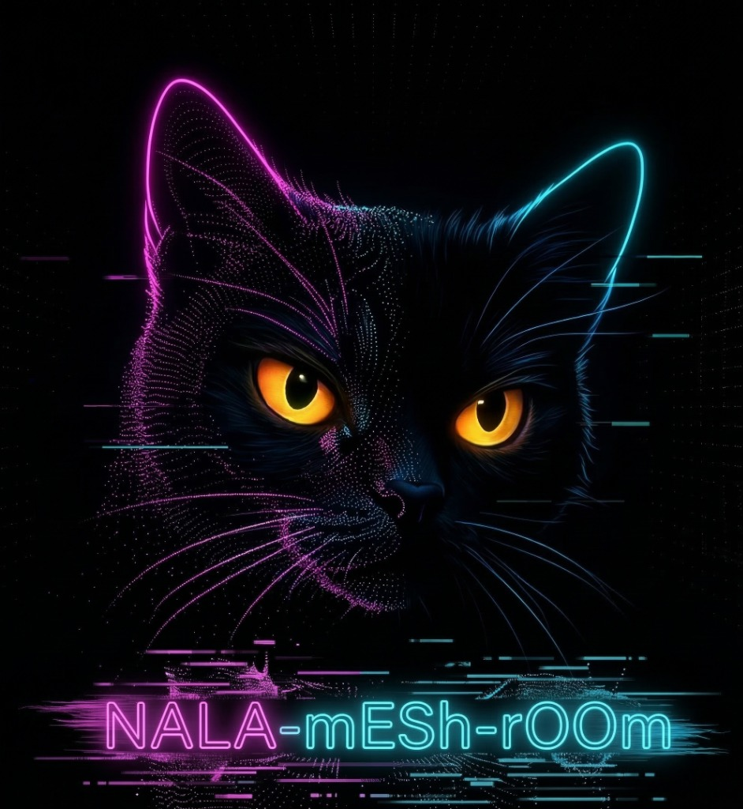

  
  <h1>NALA-mESh(rOOm) Ultimate</h1>
  <h3>Hybrid Local/Remote Photogrammetry for ComfyUI macOS</h3>

**NALA-mESh(rOOm)** is an advanced hybrid photogrammetry pipeline tailored for Apple Silicon (M1/M2/M3/M4) devices. Originating as an adaptation of the [AliceVision Meshroom](https://github.com/alicevision/Meshroom) framework, this project introduces the **Ultimate Hybrid** logic, bridging the gap between blazing-fast native macOS computing and powerful distributed NVIDIA rendering, all accessible via a custom [ComfyUI](https://github.com/comfyanonymous/ComfyUI) bridging node.

---

## Architecture & Ecosystem Integration
This project strictly adheres to the **NALA Ecosystem Universal Onboarding Protocol** (Zero-Redundancy & Hub-and-Spoke). The system provides multiple ways to interact with the photogrammetry logic:

1. 🍏 **NALA 3D Studio (Native macOS SwiftUI App):** A standalone macOS `.dmg` wrapper around our highly-optimized Swift Apple Metal pipeline. No ComfyUI required! Provides real-time rendering feedback directly on your Desktop.
2. 🔄 **ComfyUI Bridge Nodes:** The custom `MeshroomRun` ComfyUI Node routes to three engines:
   - **Apple Native Engine:** Runs the pure Swift CLI (`meshroom_mac_native`).
   - **Local Meshroom:** CPU Fallback via AliceVision.
   - **Remote Meshroom (SSH Worker):** Discovers and uses your high-performance Remote Nodes / NVIDIA Workers.
3. 💡 **NALA Workflow Ideas DB:** A beautiful HTML dashboard (`nala_workflow_db.html`) acting as an intelligent prompt database for automatic ComfyUI workflow generation (Insta360 Video integration, Gaussian Splatting, etc.).

## Installation Guide
Simply run the installer on your macOS device:
`./meshroom_pro_comfy_installer.sh`

**The installer will automatically:**
- Setup the Python environments and ComfyUI folders.
- Compile the Swift native code (`meshroom_mac_native`) using `swiftc`.
- Inject the custom ComfyUI Nodes.

### Legal Attribution
*This project utilizes and interacts with concepts/binaries from AliceVision/Meshroom. All original Meshroom copyrights remain with the AliceVision contributors. The Meshroom-related scripts in this repository are subject to the [Mozilla Public License Version 2.0 (MPL-2.0)](https://www.mozilla.org/en-US/MPL/2.0/). This project is an independent wrapper and not officially endorsed by the AliceVision Association.*

 
 

  <h3>🇩🇪 DEUTSCHE BESCHREIBUNG</h3>

**NALA-mESh(rOOm)** ist eine hochentwickelte, hybride Photogrammetrie-Pipeline, die speziell für Apple Silicon (M1/M2/M3/M4) Geräte maßgeschneidert wurde. Ursprünglich als Anpassung für [AliceVision Meshroom](https://github.com/alicevision/Meshroom) gedacht, führt dieses Projekt die **Ultimate Hybrid** Logik ein: Es schließt die Lücke zwischen rasend schnellem nativen macOS-Computing und leistungsstarkem verteiltem NVIDIA-Rendering – alles zugänglich über einen eigens entwickelten [ComfyUI](https://github.com/comfyanonymous/ComfyUI) Bridge-Node.

## Architektur & Ökosystem
Dieses Projekt folgt streng dem **NALA Ecosystem Universal Onboarding Protocol** (Zero-Redundancy & Hub-and-Spoke). Das System bietet unterschiedliche Zugänge zur Photogrammetrie:

1. 🍏 **NALA 3D Studio (Native macOS SwiftUI App):** Eine eigenständige macOS `.dmg` App, die direkt auf die Apple Metal Pipeline zugreift. Gar kein ComfyUI nötig! Bietet eine GUI mit Echtzeit-Fortschrittsbalken.
2. 🔄 **ComfyUI Bridge Nodes:** Der Custom `MeshroomRun` Node steuert eine von drei Engines an:
   - **Apple Native Engine:** Nutzt Apples riesige native Leistung (M4 Max) ohne Meshroom-Overhead.
   - **Local Meshroom:** Startet klassisches AliceVision Meshroom ("Headless").
   - **Remote Meshroom (NVIDIA Worker):** Nutzt leistungsstarke Remote-GPUs im lokalen Netz via SSH.
3. 💡 **NALA Workflow Ideas DB:** Ein schickes HTML-Dashboard (`nala_workflow_db.html`), mit dem sich fertige ComfyUI Workflows für komplexe Aufgaben (Insta360, Gaussian Splatting) direkt auf den Mac herunterladen lassen.

## Installation
Führe einfach den Installer auf deinem macOS-Gerät aus:
`./meshroom_pro_comfy_installer.sh`

**Der Installer führt automatisch folgende Schritte aus:**
- Einrichten der Python-Umgebungen und ComfyUI Ordner.
- Kompilieren des nativen Swift-Codes (`meshroom_mac_native`) über den Mac Compiler `swiftc`.
- Injizieren der Custom ComfyUI Nodes in das UI.
